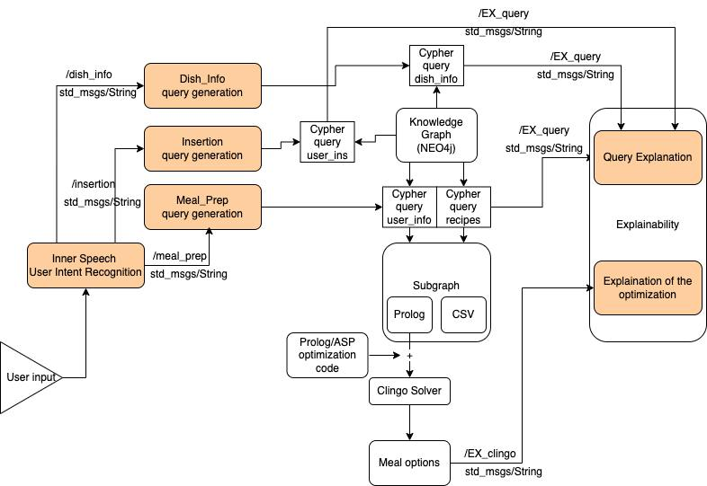

# ADVISOR Project

This repository contains a draft architecture for the ADVISOR project, which is designed to assist users in meal planning by utilizing a knowledge graph, reasoning with ASP/Prolog rules, and generating explainable recommendations.

## Architecture

The architecture of the ADVISOR project can be visualized in the following diagram:



## Project Structure

The ADVISOR project consists of 4 main modules:

### 1. `inner_speech`
This module receives the user input, classifies the request, extracts important information, and dispatches it to the appropriate functionality. It also produces a monologue that explains the "reasoning" behind the system's decision.

### 2. `neo4j_nodes`
This module handles the creation of queries based on the information extracted by the `inner_speech` module. It currently supports three functionalities:
- **User Insertion**: Inserts new users into the knowledge graph with their details.
- **Dish Information**: Retrieves information about a dish, including allergens and nutritional values.
- **Meal Preparation**: Generates meal combinations for a user based on specific nutritional needs (e.g., allergies, calories, and macros).

### 3. `clingo_nodes`
Contains nodes with ASP/Prolog rules that are used to find a good combination of dishes for meal preparation. This functionality is utilized by the meal preparation feature in the `neo4j_nodes` module.

### 4. `explainability`
This module takes the output from the other modules and generates dialogue explaining why certain options were chosen and what filtering process was applied.

## Running the Project

You can run the three functionalities separately by launching the individual modules in separate terminals. Alternatively, you can start the whole system by launching the main file in `inner_speech`:

```bash
ros2 launch inner_speech advisor.py
