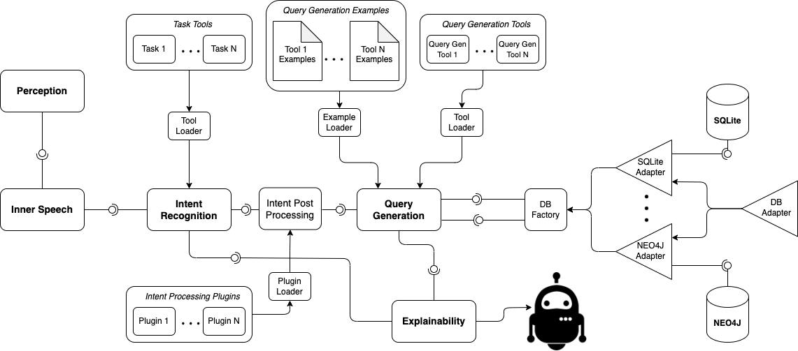

# My ROS 2 Package

This repository contains a ROS 2 package. To get started, follow the instructions below to set up your development environment and build the workspace.
## Table of Contents
- [Installation](#installation)
- [Starting the Default DB](#starting-the-default-db)
- [Usage](#usage)
  - [Launch the Full Architecture](#launching-the-full-architecture)
  - [Recommended Development & Debug Workflow](#recommended-development--debug-workflow)
  - [Environment and Configuration Setup](#environment-and-configuration-setup)
- [Testing](#testing)
- [Customization](#customizing-the-architecture)



## Installation

### Prerequisites

- **Operating System:** Ubuntu 22.04 or newer  
- **ROS 2 Distribution:** Humble Hawksbill  
  Make sure you have [ROS 2 Humble installed](https://docs.ros.org/en/humble/Installation.html).

### Setting Up the Workspace

If you don't already have a ROS 2 workspace, create one:

```bash
# Choose your workspace location
mkdir -p ~/ros2_ws/src
cd ~/ros2_ws/src
```

### Clone the Repository

Clone this repository inside the `src` directory:

```bash
git clone https://github.com/ValerioBelcamino/unipa_inner_speech
```

### Install Python Requirements

Go to the root of the workspace and install the required Python packages:

```bash
cd ~/ros2_ws
pip install -r src/unipa_inner_speech/requirements.txt
```

### Build the Workspace

Build the workspace using `colcon`:

```bash
colcon build
```

Then, source the setup file:

```bash
source install/setup.bash
```


## Starting the Default DB

We provide a pre-configured Docker image running a **Neo4j** database, along with a Python script that populates it with a ready-to-use knowledge base.

This setup allows you to:

- Run the **ADVISOR** scenario out of the box
- Verify your architecture is correctly configured
- Inspect how domain-specific knowledge is modeled and queried

### 🐳 How to Start the Database

1. Navigate to the appropriate folder:
   ```bash
   cd ~/ros2_ws/src/unipa_inner_speech/query_generation/query_generation

    Start the Neo4j container:

docker compose up -d

Run the database population script:

    python3 populate_db.py

    🧪 This will connect to the running Neo4j instance and populate it with entities and relations tailored for the ADVISOR scenario.

## 🧠 What's in the Example Database?

The default Neo4j database includes domain knowledge centered around healthy diet planning, with the following key elements:

    Entities:

        DISH – e.g., risotto, pasta, salad

        PERSON – user profiles with dietary data

        INGREDIENT – e.g., tomato, cheese

        ALLERGEN – e.g., gluten, dairy

    Relationships:

        CONTAINS

        IS_ALLERGIC_TO

        SHOULD_EAT

You can explore the database via the Neo4j browser:

http://localhost:7474

Default credentials:

    Username: Neo4j

    Password: password

    ⚠️ If the script fails to connect, ensure that Docker is running and the credentials are correct.


> ⚠️ Important: To use this example database within the architecture, make sure to set the following environment variables in the .env file located at:

```bash
~/ros2_ws/src/unipa_inner_speech/.env
```

Example content:
```bash
SCENARIO="ADVISOR"
DB_TYPE="neo4j"
NEO4J_PASSWORD="password"
NEO4J_USERNAME="neo4j"
NEO4J_URI="bolt://localhost:7687"
```
## Usage

### Launching the Full Architecture

To launch the entire system, use the main launch file provided in the `inner_speech` package:

```bash
ros2 launch inner_speech advisor.py
```

This launch file opens six terminal windows (or tabs), each running one of the system’s modules:

- **User Input**
- **Scope Detection**
- **Inner Speech**
- **Intent Recognition**
- **Query Generation**
- **Explainability**

---

### Switching Between Text and Speech Input

By default, the system uses the **text-based input** module. If you want to switch to **speech-based input** (using OpenAI's Whisper), the launch file supports this via a launch argument.

#### 🔹 Run with Text Input (default)

```bash
ros2 launch inner_speech advisor.py
```

#### 🔹 Run with Speech Input

```bash
ros2 launch inner_speech advisor.py use_audio:=true
```

> 💡 The speech input node runs a local instance of [Whisper](https://github.com/openai/whisper) for transcription.

---

### Important: Speech Dependencies Not Included

Due to the size and complexity of the dependencies (e.g., `whisper`, `torch`, etc.), **speech input dependencies are not included in `requirements.txt`**.  
If you want to use the speech-based input, you must install them manually:


> ⚠️ Make sure you have a working microphone and audio input permissions.

---

### Recommended Development & Debug Workflow

Since the launch system automatically closes terminals when any module crashes, we **strongly recommend manually launching each module** during development and testing.

You can do so using a multi-tab terminal tool (e.g. [Terminator](https://gnometerminator.blogspot.com/), `tmux`, etc.), and run the following commands in separate tabs:

```bash
# For text input
ros2 launch perception_modules user_input

# OR for speech input
ros2 run perception_nodes speech_recognition_node

# The rest of the modules
ros2 launch scope_detection scope_detection
ros2 launch inner_speech inner_speech
ros2 launch intent_recognition intent_recognition
ros2 launch query_generation query_generation
ros2 launch explainability explainability
```

This approach helps isolate issues and gives more control during integration and debugging.


## Environment and Configuration Setup

To run the architecture, you must define a `.env` file containing environment variables used throughout the system. This file should be located in:

```bash
~/ros2_ws/src/unipa_inner_speech/.env
```

### 📄 `.env` Template

```env
# Neo4j configuration (if using Neo4j)
NEO4J_PASSWORD="your_password"
NEO4J_USERNAME="your_username"
NEO4J_URI="neo4j+s://{uri}.databases.neo4j.io"

# ROS2 workspace path
ROS2_WORKSPACE="/home/{path}/src/unipa_inner_speech"

# API key for Groq (LLM provider)
GROQ_API_KEY="your_api_key"

# MySQL or SQLite configuration (if using SQL-based DB)
SQL_PASSWORD="your_password"
SQL_USER="your_username"
SQL_HOST="your_host"
SQL_DATABASE="your_database"

# Scenario selection
SCENARIO="MOVIES" # or "ADVISOR"

# Default DB type for the scenario
DB_TYPE="neo4j" # Options: neo4j, sqlite, qdrant

# Qdrant vector DB configuration (if used)
QDRANT_HOST="{host}:{port}"
QDRANT_API_KEY="your_api_key"

# Optional additional LLM provider
MISTRAL_API_KEY="your_api_key"
```

⚙️ .config File (Optional)

```config
You may also define a .config file in the same directory to configure specific LLM settings per module. The configuration must be valid JSON.

Example:

LLM_CONFIG = "{
    'intent_recognition': {
        'model_name': 'meta-llama/llama-4-maverick-17b-128e-instruct',
        'model_provider': 'groq',
        'temperature': 0.0
    },
    'scope_detection': {
        'model_name': 'llama-3.3-70b-versatile',
        'model_provider': 'groq',
        'temperature': 0.0
    },
    'inner_speech': {
        'model_name': 'llama-3.3-70b-versatile',
        'model_provider': 'groq',
        'temperature': 0.1
    },
    'query_generation': {
        'model_name': 'meta-llama/llama-4-maverick-17b-128e-instruct',
        'model_provider': 'groq',
        'temperature': 0.0
    },
    'explainability': {
        'model_name': 'llama-3.3-70b-versatile',
        'model_provider': 'groq',
        'temperature': 0.0
    }
}"
```
> 📝 This allows you to fine-tune which LLM is used for each module, the provider, and the generation temperature.


## Testing

In addition to the core functionality, this project includes testing modules for each component to ensure reliability and performance. Each module has a set of **unit tests** developed using Python and **Langsmith**.

> ⚠️ Make sure you setup a developer account on [Langsmith](https://smith.langchain.com), to generate an API key and to export it as an environment variable.

### Testing Modules Overview

- **Test Methodology**: 
  Each test relies on **manually generated examples** in the form of input/output pairs. The tests feed the input into the module and compare the generated output to the expected output.
  
- **Metrics**: 
  - For modules with **strict output formats** (such as **Intent Recognition**), the tests compute the **F1 score** on the extracted parameters to evaluate accuracy.
  - For modules producing **natural language** (e.g., **Inner Speech** and **Explainability**), we compute **cosine similarity** on the embeddings generated by **Sentence-BERT** to assess the similarity between the output and expected responses.

- **Langsmith Dashboard**: 
  - Besides these metrics, all the results of the tests are available on a **dashboard** linked to your **Langsmith account**. 
  - On the dashboard, you can see all the calls made to the LLM and track the processing of each passage. The **time taken for each example** is also recorded.

### Running the Tests

Each module includes a **test folder** that contains the Python scripts for running the tests. The tests are designed to be easily extensible with **additional examples** or **metrics** if needed.

#### Example (Intent Recognition):
1. **Locate the Test Folder**: Each module’s tests can be found in its respective `test/` folder.
2. **Running the Tests**: You can execute the tests using `pytest`:
   ```bash
   python3 -m pytest ~/ros2_ws/src/unipa_inner_speech/intent_recognition/test/test_intent_LLM.py


## Customizing the Architecture
### Important: For a complete walkthrough of how to define new scenarios, actions, and tools — including how to add new DB adapters — refer to the 📄 [Customization Guide](docs/customizing_the_architecture.md). Here we provide a general overview of how the system works.

This architecture is designed to support **multiple domains**, each defined as a *scenario* with:

- A natural language **description** of the assistant's role
- A set of **supported actions**
- One or more **knowledge bases** (default and optional)

---

### Defining a Scenario

A scenario is a specific use case that frames the assistant's behavior.

**Example scenario for diet suggestions ADVISOR**:  
> *"You are an AI assistant helping a user follow a proper diet plan."*

#### 🧠 Supported Actions

Each action is defined using a **Pydantic model**. Actions include:
- A docstring describing what the action does
- Parameters with:
  - Type
  - Description
  - Optional default value
  - Whether the parameter is mandatory

**Example**: `AddToDatabase` action for the diet scenario

```python
class AddToDatabase(BaseModel):
    """A new user asks you to add them to the database. 
    Extract necessary information from the user message. 
    Do not generate any new information, use only what user provided for you."""

    nome_utente: str = Field(description="The name of the user in lowercase")
    calorie: int = Field(description="How many calories user should eat per day", default=0)
    proteine: int = Field(description="How many grams of protein user should eat per day", default=0)
    carboidrati: int = Field(description="How many carbohydrates user should eat per day", default=0)
    grassi: int = Field(description="How many fats user should eat per day", default=0)
    intolleranze: Optional[List[str]] = Field(description="User's intollerances", default='')

mandatory_parameters = ['nome_utente', 'calorie', 'proteine', 'carboidrati', 'grassi']
```

Each action has an associated **query generation tool**, as well as example files to improve the query and answer generation process.

---

### Databases and the Adapter Pattern

Each scenario includes a **default knowledge base**, typically a database that the assistant queries to gather or verify information.

We use an **adapter design pattern** to abstract away the database implementation, currently supporting:

- `Neo4j`
- `MySQL`
- `Qdrant` (vector search)

Besides the default DB, specific tools can also depend on **additional databases** as needed.

---

### 🎬 Example: MOVIES Scenario

> *"You are an AI assistant helping a user explore a database of movies and cinema showtimes."*

#### 🗃️ Default Database: MySQL (for timetables)

```python
class TimetableInfo(BaseModel):
    """User asks you to find a timetable for a movie. 
    Extract relevant information from the user input and return it in a structured format."""

    title: Optional[str] = Field(description="Movie title in lowercase")
    cinema: Optional[str] = Field(description="Name of the cinema in Genova in Title Case", default='', examples=['UCI Fiumara', 'Circuito Odeon'])
    language: Optional[str] = Field(description="Language of the movie, using ISO 639-1 codes", default='', examples=['it', 'en'])
    dates: Optional[List[str]] = Field(description="List of dates of the screening in the format YYYY-MM-DD", default=[])
    time: Optional[List[str]] = Field(description="List of times of the screening in the format HH:MM", default=[])
```

#### 📚 Additional DB: Qdrant (for movie metadata)

Used by tools like `MovieInfo`, which extract descriptive movie data.

```python
class MovieInfo(BaseModel):
    """User asks you to give them information about a specific movie.
    Extract details of the movie to query a vector database with semantic similarity."""

    title: Optional[str] = Field(description="Movie title in lowercase only ASCII characters", default='')
    director: Optional[str] = Field(description="The name of the movie director in lowercase", default='')
    genres: Optional[List[str]] = Field(description="The genres of the movie", default='', examples=['action', 'comedy', 'drama'])
    year: Optional[int] = Field(description="The year of the movie", default=0)
    actors: Optional[List[str]] = Field(description="The actors of the movie in lowercase", default=[])
    descriptive_movie_facts: Optional[List[str]] = Field(description="Additional descriptive facts about the movie itself", default=[])
```

This tool uses **cosine similarity** on the vectorized representation of user input to retrieve the most relevant movie content from a Qdrant DB.

Therefore, the MOVIES scenario supports two different DBs at runtime.

